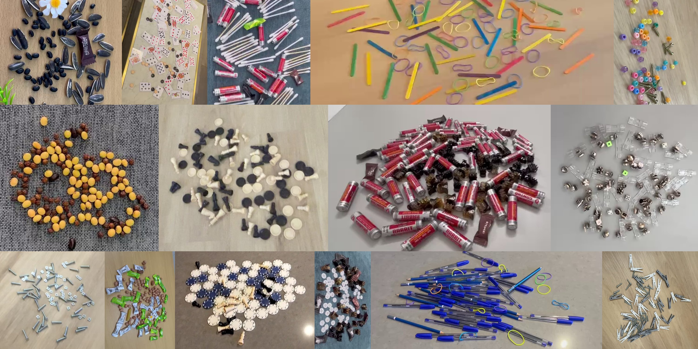
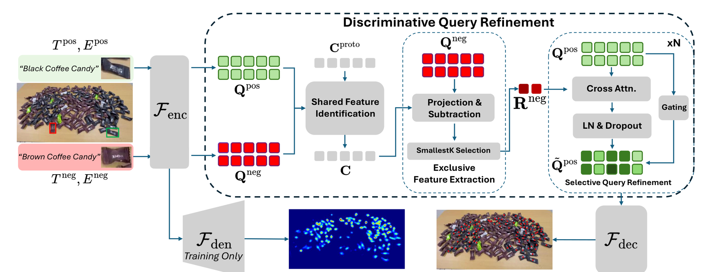
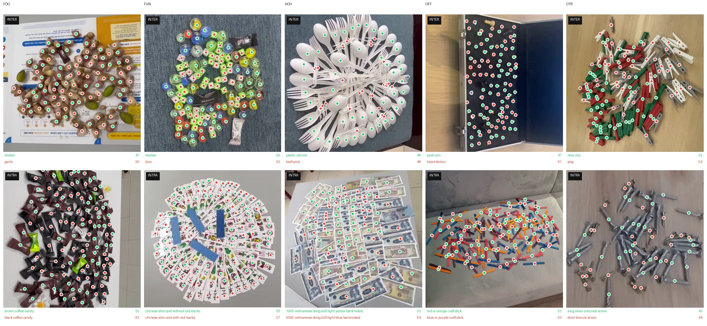

<p align="center">
  
</p>

<div align="center">

# CountEx: Fine-Grained Counting via Exemplars and Exclusion

Yifeng Huang<sup>1</sup> · Gia Khanh Nguyen<sup>2</sup> · Minh Hoai<sup>2</sup>

<sup>1</sup>Department of Computer Science, Stony Brook University<br>
<sup>2</sup>Australian Institute for Machine Learning, Adelaide University

**ECCV 2026**

**[Paper](https://arxiv.org/abs/2602.19432)** &nbsp;•&nbsp;
**[Project page](https://bbvisual.github.io/CountEx/)** &nbsp;•&nbsp;
**[CoCount dataset](https://huggingface.co/collections/BBVisual/cocount)** &nbsp;•&nbsp;
**[Models](https://huggingface.co/collections/BBVisual/countex)** &nbsp;•&nbsp;
**[Demo](https://huggingface.co/spaces/yifehuang97/CountEx)** &nbsp;•&nbsp;
**[Training logs](https://wandb.ai/yife/CountEx_KC/)**

</div>

---

CountEx lets you say both what to count **and what to ignore**, through natural-language
descriptions and optional visual exemplars. Existing prompt-based counters support only inclusion,
so cluttered scenes with confusable categories produce ambiguity and overcounting: black beans among
soy beans, black coffee candies among brown ones, screws among nails. At its core is a
**Discriminative Query Refinement** module, which identifies features the target and distractor
share, isolates the exclusion-specific patterns, then selectively suppresses them to refine the
counting query.

<p align="center">
  
</p>

<div align="center">
<em><b>Overview of CountEx.</b> Shared Feature Identification pools learnable prototypes over the
positive and negative query sets to capture what the two classes share; Exclusive Feature Extraction
projects that component out and keeps the most distinctive negative residuals; Selective Query
Refinement subtracts them from the positive queries by gated cross-attention. The density branch is
used at training time only.</em>
</div>

<br>

Alongside the method we release **CoCount**, a large fine-grained counting benchmark in which
*every* image contains two confusable classes annotated independently, so a model cannot score
well by simply counting "all the small round things."

This work follows on from **[PairTally](https://github.com/bbvisual/PairTally_Benchmark)**
(DICTA 2025) by the same authors, which introduced the fine-grained counting setting as a
benchmark: 681 controlled images pairing two confusable categories, on which ten models across
three counting paradigms were shown to miss the intended target. PairTally is diagnostic and too
small to train on; CoCount scales the same paired design to 10,086 annotated frames over 97
category pairs, and CountEx supplies the exclusion mechanism PairTally showed was missing. CountEx
is also evaluated on PairTally, where it outperforms all reported baselines.

> **Hardware note:** all training and inference run in `bf16`, so an NVIDIA **Ampere or newer** GPU
> is required. All experiments were conducted on NVIDIA RTX A5000 GPUs.

---

## The CoCount dataset

<div align="center">
  
</div>

<div align="center">
<em>One example per supercategory (columns) for each pairing mode (rows).
<b>Green</b> = positive class dots, <b>red</b> = negative class dots; per-class counts at right.
<b>INTER</b> pairs two different object classes; <b>INTRA</b> pairs two variants of the same class
(colour, size, marking): the harder case.</em>
</div>

<br>

Every image is annotated with **two** independent dot sets, one per class, so the same scene
serves as both a positive and a negative counting target. This is what makes the benchmark
fine-grained: getting the right answer requires discriminating the target from a distractor that a
generic class-agnostic counter would happily include.

CoCount comprises **10,086 annotated frames** across **97 category pairs** in five
supercategories. Because both classes in a frame are annotated, each frame yields **two** counting
queries (count A excluding B, then count B excluding A), and the released splits store one record
per query. So `CoCount-train` has 14,834 rows over 7,417 distinct frames; likewise 1,335 val and
1,334 test frames.

**Scale of the training split**, over distinct frames:

| Supercategory | Code | Frames | Class pairs | INTER | INTRA | Annotated points | Count range |
|---|:--:|---:|---:|---:|---:|---:|:--:|
| Food | `FOO` | 1,820 | 19 | 920 | 900 | 434,240 | 4-472 |
| Game | `FUN` | 1,270 | 20 | 578 | 692 | 123,277 | 2-145 |
| Home | `HOU` | 1,710 | 20 | 884 | 826 | 244,164 | 4-283 |
| Desk | `OFF` | 1,720 | 20 | 960 | 760 | 253,180 | 5-312 |
| Misc | `OTR` | 897 | 18 | 446 | 451 | 104,775 | 4-269 |
| **Total** | | **7,417** | **97** | **3,788** | **3,629** | **1,159,636** | **2-472** |

Counts per class are dense and long-tailed: median 53, mean 78, and fewer than half of all classes
have 50 objects or fewer:

| Objects per class | ≤10 | ≤25 | ≤50 | ≤100 | ≤200 | ≤400 |
|---|---:|---:|---:|---:|---:|---:|
| Cumulative share | 3.4% | 18.7% | 47.8% | 76.2% | 93.0% | 99.5% |

**Per-image fields:** `image`, `pos_caption` / `neg_caption` (class names), `pos_count` /
`neg_count`, `pos_points` / `neg_points` (absolute-pixel dot coordinates),
`positive_exemplars` / `negative_exemplars` (exemplar boxes), plus `category` (the
`{INTER,INTRA}_{SUPER}_{classA}_{classB}` pair id), `video_id` and `image_name`.

```python
from datasets import load_dataset

ds = load_dataset("BBVisual/CoCount-train", split="train")
ex = ds[0]
print(ex["pos_caption"], ex["pos_count"], len(ex["pos_points"]))
print(ex["neg_caption"], ex["neg_count"], len(ex["neg_points"]))
```

### Corrected test annotations

We identified an annotation issue in the test-set **evaluation labels** and corrected the affected
annotations. The issue is limited to evaluation labels and does not affect the training
annotations used by CountEx, since CountEx trains from dot annotations.

The released dataset now contains the corrected test labels. Because the paper was submitted
before the correction, the paper's reported results use the original labels. The table below gives
CountEx under both. Differences are small and the conclusions are unchanged.

| Split | # Corrected images | MAE (paper) | MAE (corrected) | Δ MAE | RMSE (paper) | RMSE (corrected) | Δ RMSE |
|---|---:|---:|---:|---:|---:|---:|---:|
| Food | 30 | 37.04 | 37.40 | 0.36 | 50.58 | 51.30 | 0.72 |
| Home | 0 | 24.16 | 24.16 | 0.00 | 34.87 | 34.87 | 0.00 |
| Desk | 18 | 31.18 | 27.89 | 3.29 | 51.90 | 46.47 | 5.43 |
| Misc | 72 | 23.82 | 22.97 | 0.85 | 32.68 | 31.88 | 0.80 |
| Game | 30 | 16.84 | 16.84 | 0.00 | 24.26 | 24.26 | 0.00 |
| **KC (overall)** | **150** | **12.72** | **11.20** | **1.52** | **23.99** | **20.32** | **3.67** |

For the Game split, 30 frames were updated but the corrected counts are very close to the
originals, so MAE/RMSE are unchanged after rounding.

To reproduce **the numbers printed in the paper**, use the `*_reported.sh` scripts; they point
`--test_data_path` at `BBVisual/CoCount-test_reported_in_paper` (the pre-correction labels). The
plain scripts evaluate on the corrected `BBVisual/CoCount-test`, and are what you should use for
new comparisons.

---

## Setup

```bash
git clone https://github.com/bbvisual/CountEx.git
cd CountEx

conda create -n countex python=3.10.18
conda activate countex

# PyTorch, CUDA 12.1
pip install torch==2.3.0 torchvision==0.18.0 torchaudio==2.3.0 \
    --index-url https://download.pytorch.org/whl/cu121

pip install transformers==4.42.0 deepspeed==0.17.0 accelerate==1.6.0 \
    wandb datasets matplotlib scipy

# training only, for gcc-11
conda install -c conda-forge gcc=11 gxx=11
```

All of the above is also scripted:

```bash
bash src/eval_env_setup.sh
```

### Hugging Face token

Export a token before running anything that pulls data or checkpoints:

```bash
export HF_TOKEN=your_huggingface_token_here
```

The provided scripts contain an empty `export HF_TOKEN=""` line; either fill it in or delete that
line and rely on your shell environment. Each script also pins `CUDA_VISIBLE_DEVICES`
(eval: `1`, train: `0,1,2,3`). Edit these to match your machine.

---

## Evaluation

CountEx is evaluated in two settings on CoCount:

- **KC (Known-Category)**: all five supercategories are seen during training; measures
  performance on categories the model has seen.
- **NC (Novel-Category)**: one supercategory is held out for test while training on the other
  four; measures zero-shot generalisation to unseen object categories.

```bash
cd src

# KC, corrected labels
bash scripts/eval/kc.sh

# NC, hold out one supercategory
bash scripts/eval/nc_food.sh   # test Food; train Home, Desk, Misc, Game
bash scripts/eval/nc_home.sh   # test Home; train Food, Desk, Misc, Game
bash scripts/eval/nc_desk.sh   # test Desk; train Food, Home, Misc, Game
bash scripts/eval/nc_misc.sh   # test Misc; train Food, Home, Desk, Game
bash scripts/eval/nc_game.sh   # test Game; train Food, Home, Desk, Misc
```

Append `_reported` to any of these to evaluate against the original pre-correction paper labels,
e.g. `bash scripts/eval/kc_reported.sh`.

Each script pulls its checkpoint from the Hub (`BBVisual/CountEX-KC`,
`BBVisual/CountEX-NC-Food`, …), so no local weights are needed.

Split codes used by `--data_split`, if you invoke `eval.py` directly:

| Setting | Food | Game | Home | Desk | Misc | All |
|---|:--:|:--:|:--:|:--:|:--:|:--:|
| `--data_split` | `FOO` | `FUN` | `HOU` | `OFF` | `OTR` | `ALL` |

---

## Training

```bash
cd src

bash scripts/train/kc.sh       # KC setting, all supercategories

bash scripts/train/nc_food.sh  # hold out Food
bash scripts/train/nc_home.sh  # hold out Home
bash scripts/train/nc_desk.sh  # hold out Desk
bash scripts/train/nc_misc.sh  # hold out Misc
bash scripts/train/nc_game.sh  # hold out Game
```

Defaults: 4 GPUs via `accelerate` + DeepSpeed ZeRO-2 (`ddp_cfgs/zero2.json`,
`ddp_cfgs/1n4r.yaml`), 3 epochs, constant LR `1.5e-5`, per-device batch size 1, seed `888`.

**Before launching, edit `--output_dir`** in the training scripts; it is hardcoded to an
author-machine path (`/data/add_disk0/yifengc/countex_exp`). Set `WANDB_API_KEY` as well, or change
`--report_to` to `"none"` if you do not want Weights & Biases logging.

Reference training curves for the KC setting: **[wandb logs](https://wandb.ai/yife/CountEx_KC/)**.

---

## Live demo

Try CountEx in the browser: upload an image, box a few positive and negative exemplars, get a
count: **[huggingface.co/spaces/yifehuang97/CountEx](https://huggingface.co/spaces/yifehuang97/CountEx)**

---

## Repository layout

```
src/
├── train.py                     # training entry point (HfArgumentParser)
├── eval.py                      # evaluation entry point
├── trainer.py                   # custom Trainer
├── criterion.py                 # losses
├── utils.py                     # dataset building, collation, post-processing
├── eval_env_setup.sh            # one-shot environment install
├── hf_model/
│   ├── CountEX.py               # the CountEx model
│   ├── modeling_grounding_dino.py
│   └── mmdet2groundingdino_swin{t,b,l}.py   # mmdet → HF weight converters
├── ddp_cfgs/                    # accelerate + DeepSpeed configs
└── scripts/
    ├── eval/                    # kc.sh, nc_*.sh (+ *_reported.sh variants)
    └── train/                   # kc.sh, nc_*.sh
docs/                            # project page (GitHub Pages)
```

---

## Citation

<!-- TODO: add the page range once the proceedings are out. -->

```bibtex
@inproceedings{countex2026,
  title     = {CountEx: Fine-Grained Counting via Exemplars and Exclusion},
  author    = {Huang, Yifeng and Nguyen, Gia Khanh and Hoai, Minh},
  booktitle = {European Conference on Computer Vision (ECCV)},
  year      = {2026}
}
```

If you use CoCount or build on the fine-grained counting setting, please also cite PairTally, which
introduced it:

```bibtex
@inproceedings{nguyen2025pairtally,
  title     = {Can Current AI Models Count What We Mean, Not What They See?
               A Benchmark and Systematic Evaluation},
  author    = {Nguyen, Gia Khanh and Huang, Yifeng and Hoai, Minh},
  booktitle = {Digital Image Computing: Techniques and Applications (DICTA)},
  year      = {2025}
}
```
